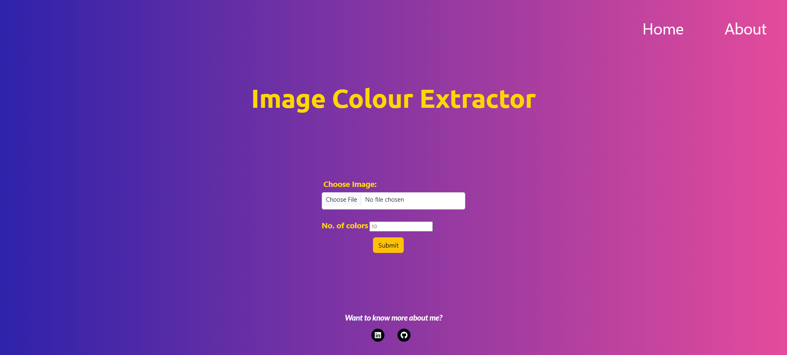
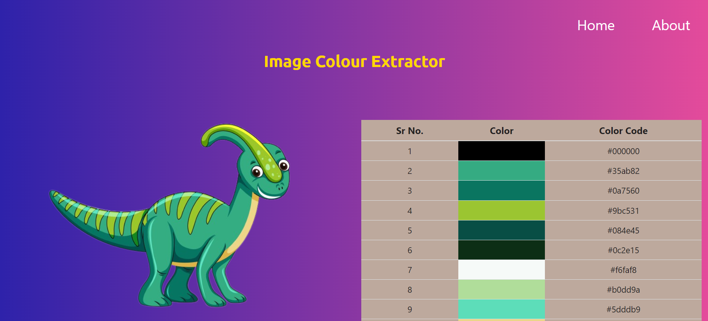
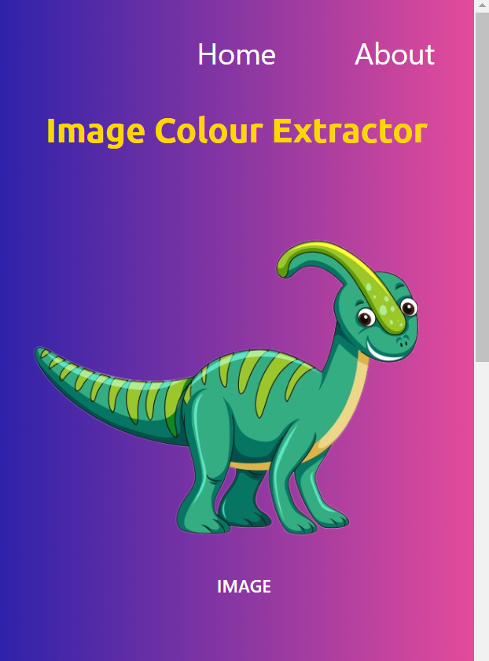
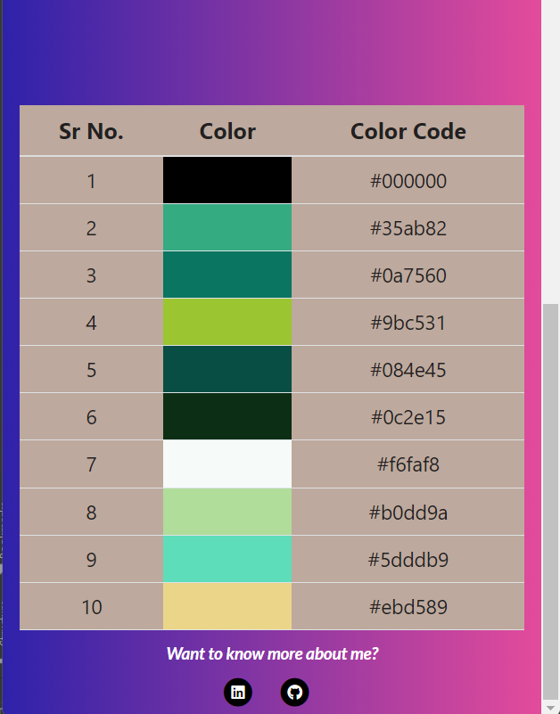

# Color Extracting Site

## Description

The Color Extracting Site is a web application built with Python Flask, Flask Bootstrap, NumPy, OpenCV and scikit-learn. Users can upload an image, and the application will analyze the image to identify and display the topmost common colors.

## Features

- **Image Upload**: Users can upload an image through the web interface.
- **Image Processing**: Reading an image using OpenCV, converting it into a NumPy array, and then converting the color representation from BGR to RGB using cv2 module.
- **Color Extraction**: The application  applies the K-Means clustering algorithm to identify dominant color clusters, counts the pixels in each cluster, and returns a list of hex codes.
- **Top Colors**: The application identifies and displays the top most common colors in the image.
- **Responsive Design**: The site is designed to be responsive, ensuring a consistent experience across different devices.

## Dependencies
- Python 3.x
- Flask
- Flask Bootstrap
- NumPy
- sklearn
- OpenCV
 
## Usage

1. Open your web browser and navigate to http://localhost:5000.
2. Click on the "Choose File" button to upload an image.
3. Enter the number of colors to be extracted.
4. Click the "Submit" button to analyze the image.
5. View the results displaying the top most common colors in the image. The user can copy the desired color hex code for further use.

## Working of Website:

### Home Page:

### About Page:

### Upload:

### Working:

### Reactivity for smaller screens:

